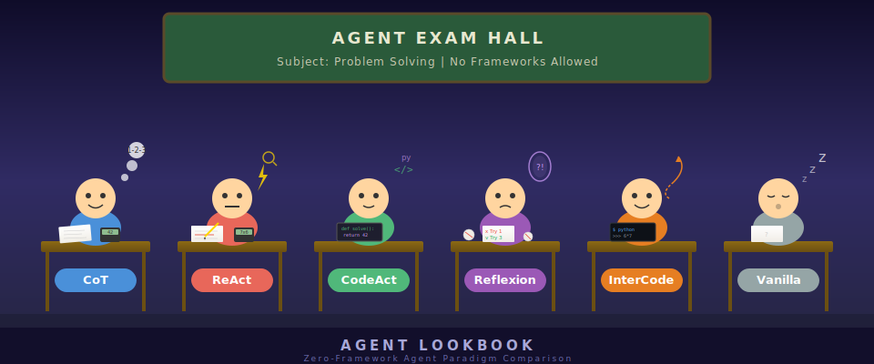

# Agent Lookbook

<p align="center">
  
</p>

A from-scratch experiment comparing LLM agent paradigms side by side -- no frameworks, just raw API calls.

Each paradigm (CoT, ReAct, CodeAct, Reflexion, InterCode, ...) is implemented as a self-contained Python class that talks to LLM APIs via `requests.post()`. A Streamlit UI lets you send the same query to multiple paradigms simultaneously and compare their reasoning traces.

## Quick Start

```bash
# 1. Clone and enter
git clone <repo-url> && cd AgentLookbook

# 2. Create venv (Python 3.12)
python3.12 -m venv .venv
source .venv/bin/activate

# 3. Install dependencies
pip install -r requirements.txt

# 4. Configure API keys
cp .env.example .env
# Edit .env with your keys (Qwen / GLM / DeepSeek)

# 5. Run the UI
streamlit run app.py
```

## Implemented Paradigms

| Paradigm | Core Idea | Paper |
|----------|-----------|-------|
| **Vanilla** | Direct LLM call. Baseline. | -- |
| **CoT** | "Think step by step" before answering | [Wei et al., 2022](https://arxiv.org/abs/2201.11903) |
| **ReAct** | Interleave Thought / Action / Observation | [Yao et al., 2023](https://arxiv.org/abs/2210.03629) |
| **CodeAct** | Generate executable Python code as actions | [Wang et al., 2024](https://arxiv.org/abs/2402.01030) |
| **Reflexion** | Self-reflect on failures, retry with insight | [Shinn et al., 2023](https://arxiv.org/abs/2303.11366) |
| **InterCode** | Interactive coding with execution feedback | [Yang et al., 2023](https://arxiv.org/abs/2306.14898) |
| **ToT** | BFS over multiple reasoning paths, evaluate & select best | [Yao et al., 2023](https://arxiv.org/abs/2305.10601) |
| **GoT** | Decompose, solve sub-problems, aggregate, refine | [Besta et al., 2024](https://arxiv.org/abs/2308.09687) |
| **AdaPlanner** | Adaptive plan-execute with in-plan & out-of-plan refinement | [Sun et al., 2023](https://arxiv.org/abs/2305.16653) |
| **ADaPT** | Recursive as-needed decomposition: solve or decompose & recurse | [Prasad et al., 2023](https://arxiv.org/abs/2311.05772) |
| **ReCode** | Recursive code tree: decompose into stubs, expand, execute | [FoundationAgents, 2025](https://arxiv.org/abs/2510.23564) |

## Project Structure

```
AgentLookbook/
├── app.py                 # Streamlit UI -- side-by-side comparison
├── config.py              # Load API keys from .env
├── AGENT.md               # Internal guidelines & paradigm references
│
├── agents/                # One file per paradigm
│   ├── base.py            # BaseAgent, AgentResult, ThinkStep
│   ├── registry.py        # @register_agent decorator
│   ├── vanilla.py         # Direct LLM call (baseline)
│   ├── cot.py             # Chain-of-Thought
│   ├── react.py           # ReAct
│   ├── codeact.py         # CodeAct
│   ├── reflexion.py       # Reflexion
│   ├── intercode.py       # InterCode
│   ├── tot.py             # Tree of Thoughts
│   ├── got.py             # Graph of Thoughts
│   ├── adaplanner.py      # AdaPlanner
│   ├── adapt.py           # ADaPT
│   └── recode.py          # ReCode
│
├── llm/                   # Raw HTTP LLM clients (no SDK)
│   ├── base.py            # LLMClient ABC + OpenAICompatibleClient
│   ├── qwen.py            # Qwen via DashScope
│   ├── glm.py             # GLM via 智谱 BigModel
│   └── deepseek.py        # DeepSeek
│
├── tools/                 # Tools available to agents
│   ├── base.py            # Tool ABC + ToolRegistry
│   ├── calculator.py      # Math expression evaluator
│   └── search.py          # Mock WikiSearch
│
├── paper/                 # Reference papers (PDF)
└── grade-school-math/     # GSM8K evaluation dataset
```

## LLM Providers

All three use OpenAI-compatible `/v1/chat/completions`:

| Provider | Default Model | Docs |
|----------|---------------|------|
| Qwen (DashScope) | `qwen-plus` | [dashscope.aliyuncs.com](https://dashscope.console.aliyun.com/) |
| GLM (智谱) | `glm-4-flash` | [open.bigmodel.cn](https://open.bigmodel.cn/) |
| DeepSeek | `deepseek-chat` | [platform.deepseek.com](https://platform.deepseek.com/) |

## How It Works

1. Pick a provider and enter your API key in the sidebar
2. Select which paradigms to compare (checkboxes)
3. Type a question and hit **Run**
4. All selected paradigms run in parallel on the same query
5. Results show side by side with expandable thinking traces

## Adding a New Paradigm

```python
# agents/your_paradigm.py
from agents.base import BaseAgent, AgentResult, ThinkStep
from agents.registry import register_agent

@register_agent
class YourAgent(BaseAgent):
    paradigm_name = "YourParadigm"
    paradigm_description = "One-line explanation"

    def run(self, query: str) -> AgentResult:
        # Use self.llm.chat(messages) for LLM calls
        # Use self.tools.get("Calculator").run("2+3") for tools
        # Record steps as ThinkStep(type="thought", content="...")
        return AgentResult(answer="...", steps=[...])
```

Then add `import agents.your_paradigm` to `agents/__init__.py` -- it auto-appears in the UI.

## Design Principles

- **Zero framework dependency** -- only `requests`, `streamlit`, `python-dotenv`
- **Each agent is self-contained** -- prompt templates and logic live in the same file
- **Pluggable LLM backends** -- adding a new provider is ~10 lines (subclass `OpenAICompatibleClient`)
- **Transparent reasoning** -- every intermediate step is captured as a `ThinkStep` for visualization

## Roadmap

- [x] Phase 1: Single-turn comparison (Vanilla, CoT, ReAct, CodeAct, Reflexion, InterCode, ToT, GoT, AdaPlanner, ADaPT, ReCode)
- [ ] Phase 2: Multi-turn conversation with memory retention
- [ ] Phase 3: Real tool integration, evaluation benchmarks (GSM8K, etc.)
- [ ] More paradigms: ReWOO, BOLAA

## TODO and Disclaimer

purely AI work, ingest papers and online sources, official/unofficial implementations

### TODO
- [] Check/review all the implementation
- [] expose system prompt to help understanding
- [] review the metrics implementation, some LLM calls seems untrustworthy
- [] Multi-round conversation

## License